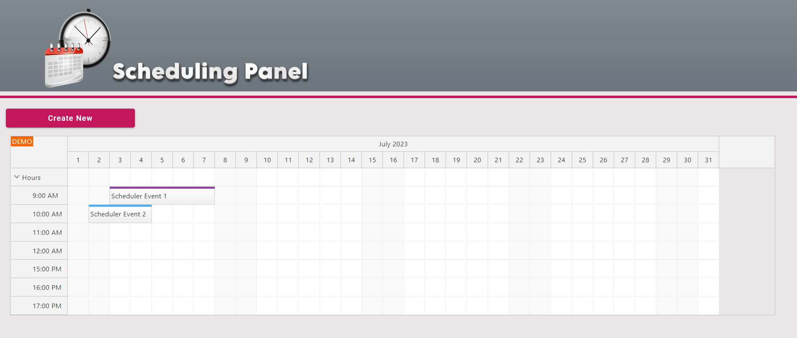
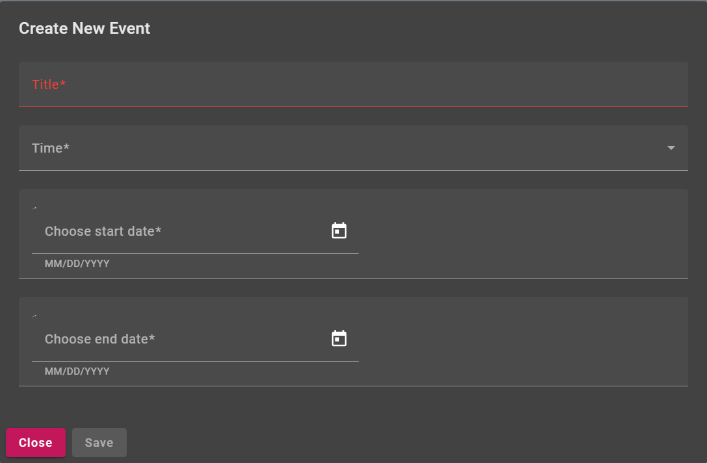
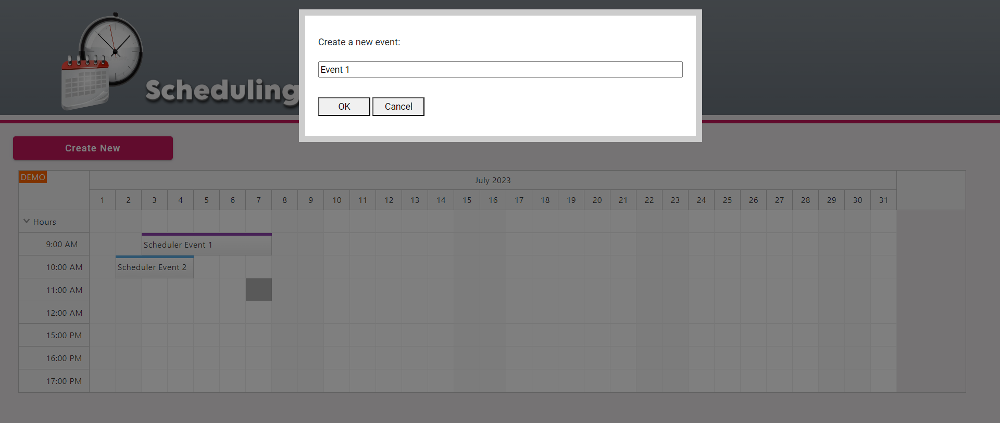
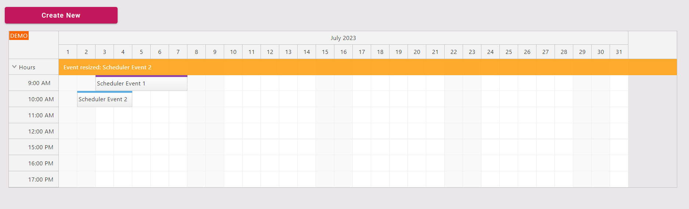

# Scheduling Calendar App
This is an web application for scheduling events and managing calendars. It is built with Angular and Typescript.
This project was generated with [Angular CLI](https://github.com/angular/angular-cli) version 16.1.3.

## Features

This application consists of the below features:
1.	Form to add a calendar event contains required validations
2.	Ability to create new event by clicking on calender cells
3.	Ability to delete the events
4.	Ability to move the events
5.	Ability to change duration of events
6.	Use angular material calender to work with date
7.	Use form validation to validate events properties

## Project Snapshots

### - Main Page:
  

### - Create new event:
  

### - Create new event by clicking on calender cell:
  

### - Event resize:
  

## Installation

To run the application locally, you will need to have Node.js and npm installed on your system. Then, follow these steps:

1. Clone the repository to your local machine:
  'git clone https://github.com/AshrafSharifi/SchedulingCalenderApp.git'
2. Navigate to the project directory:
  'cd SchedulingCalenderApp'
3. Install the dependencies:
  'npm install'
4. Start the development server:
  'ng serve'
5. Open your browser and navigate to 'http://localhost:4200'. The application will automatically reload if you change any of the source files.

## Code scaffolding

Run `ng generate component component-name` to generate a new component. You can also use `ng generate directive|pipe|service|class|guard|interface|enum|module`.

## Build

Run `ng build` to build the project. The build artifacts will be stored in the `dist/` directory.

## Contributing

If you would like to contribute to the project, please follow these steps:

1. Fork the repository to your own GitHub account.
2. Clone the forked repository to your local machine.
3. Create a new branch for your changes:
  'git checkout -b my-new-feature'
4. Make your changes and commit them:
  'git commit -am 'Add some feature'
5. Push your changes to your forked repository:
  'git push origin my-new-feature'
6. Create a pull request from your forked repository to the original repository.
